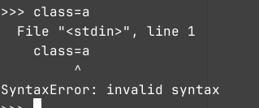

# 创造一个复读机🤖

这一章节我们将会以一个_复读机程序_，从这个复读机程序来教会你Python的**输入**，**输出**，和**存储数据**

## 程序 🎈

在此之前，我们先来再次定义一下程序。计算机科学上常说，**算法+数据结构=程序**，你现在肯定听不懂。那我们用生活来类比：程序就是在厨房做饭，我们拿到食材，经过煎炒炸等操作，做出饭菜，端到餐桌上，这个过程和计算机程序有异曲同工之妙：

| 做饭   | 计算机   |
| ------ | -------- |
| 拿食材 | 输入数据 |
| 烹调   | 处理数据 |
| 上菜   | 输出数据 |

可见，计算机程序的功能就是把输入的数据进行处理，然后把处理好的数据输出出去，这个概念可能还是比较抽象，我们用复读机程序一个例子就好理解了

## 复读机

我们分析复读机的工作流程：

- 录音(输入数据)
- 把录制的音频存储到内存里(处理数据)
- 念出来(输出数据)

那么，我们的程序的流程就是

- 读取用户的输入

- 存储用户输入

- 输出用户输

## 输入

 在Python中，使用`input()`来进行输入，示例：

```python
input()
```

运行程序，但是命令行并没有反应，我们可以输入一些东西，然后按下回车键确定输入的内容，程序结束运行，没有输出，因为我们根本没有让程序做任何输出。input的括号里还可以写一个用单引号或双引号包裹的文字，作为输入提示词，示例：

```python
input("请输入：")
```


## 存储用户输入

我们刚才读取了用户的输入，但是我们并没有对这个数据进行接收也就是存储数据。在Python中，我们使用变量进行存储数据。使用`<变量名>=<变量的值>`来定义一个变量，示例

```python
x=1
```

在这个示例中，我们定义了一个变量，它的名称是`x`，它的值为`1`，定义变量并给他值的过程称为**赋值**，我们可以直接用它的变量名x来读取它的值，示例：

```python
print(x)
```

输出:

```
1
```

我们可以把`input()`作为一个值，把他赋值给一个变量，示例：

```python
data=input()
```

### 变量名

我们给变量起名，应当符合这些**规则**和**规约**，规则不能打破，打破了就会发生**报错**，像是这样：



起变量名字的规则有这些：

- **变量名不能是Python的保留字如class**

- **变量名的开头不能是数字**

- **变量名内不能有除了`_`下划线以外的任何符号**

- **区分大小写**，var和Var是两个变量

规约是开发者之间的君子协定，你可以打破，但是打破了会降低你的代码的可读性，因此我建议你遵守这些规约，Python的规约叫做**[PEP-8](https://peps.python.org/pep-0008/)**,他是龟叔写的，PEP-8规约的要求有一下几点：

- 对于**变量**、*函数*、*方法名*，使用**蛇形命名法**，用下划线来分割每一个单词，示例:`user_name`

- 对于*类*名，使用**大驼峰命名法**，每个单词的首字母大写，示例:`MysqlConfig`

- 对于*常量*，使用全大写蛇形命名法，每个字母都大写，用下划线来分割单词,示例:`SERVER_PORT`

- 名称不宜过长，1-2个单词最好

- 见名知意

- 单个字符变量只用于临时变量

### 常量

Python没有常量，我们用全大写的变量名来表示这是一个常量，不要修改。但实际上，你想要修改也没人拦着。

## 输出

在Python中使用`print(<输出内容>)`来输出数据，此前我们已经多次使用过了，我们也可以输出多个内容，在括号里写下你要输出的内容，然后用逗号分割，这样做Python会输出括号里面的每个内容，使用一个空格分割每个内容，示例:

```python
a=1
b=2
c=3
print(a,b,c)
```

## 注释

我们有时候需要解释我们写的代码，这时候，我们就需要给我们的代码写上注释，注释是给人看的，不是给机器看的，Python会自动忽略程序里的注释。在Python中，我们使用`#`来表示注释，在一行代码内，`#`后的内容都是注释，都会被Python忽略，除了被单引号或双引号包裹的*字符串*里面的`#`，示例:

```python
a=1 #这是一个变量
print(a) #输出这个变量
print('#') #这行里第一个#不是注释
```

## 完成这个复读机

掌握了这些知识，我们就可以做出这个复读机程序，代码:

```python
data=input("请输入：")
print(data)
```

## 拓展

事实上，这个复读机还可以简化为一行代码：

```python
print(input("请输入："))
```

为什么这也是可行的呢？这个将会在*函数*这一章节中解释。同时，本章节还出现了多个未学习的概念，这些概念均使用斜体标注，我们会在以后的章节一一解释……
