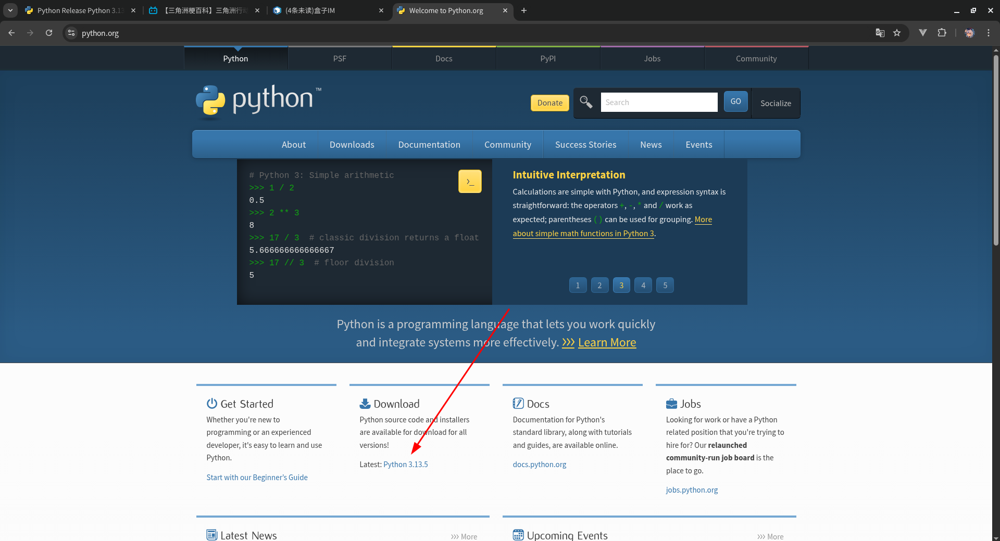
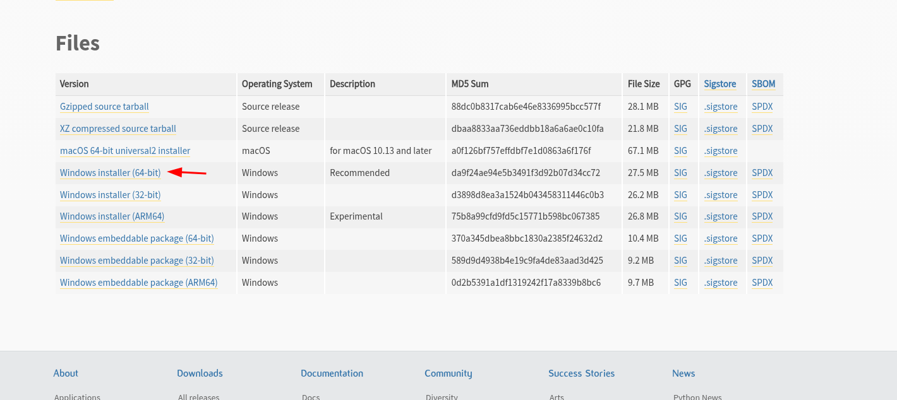

# Python，启动！

## 编程

在讲Python之前，先来谈一谈什么是编程，毕竟让Python再次伟大本质上还是让编程再次伟大。

编程，就是编写计算机程序，用更严谨的词语表达它叫程序设计。那啥是程序哦？说白了，就是给**计算机下的指令(单)**，让他按照你的步骤干活。编程的本质就是下指令，你可以想象成你作为导演，计算机就是你指挥的演员，你说啥它干啥。

> 编程其实来源于苏联，因为苏联人写计算机程序是真的要穿针引（铜）线的

在生活中，我们用人类的语言来指挥别人，而这些人类语言，计算机……一个都不认识！计算机只认二进制的0和1，这种代码叫做**机器码**，这样写出来的代码有可能是这样的...

```bin
10010000 11011010 00000000 11110011
```

你觉得能看吗？很显然，这不是人类能理解的，人类嫌麻烦，就发明了易于翻译成**机器码**的**编程语言**。常见的编程语言有Java,Python,C,C++,Rust,Kotlin,它们各有各的应用范围，例如Kotlin常用于安卓应用开发，Java常用于网站的后端，而我们所学的Python几乎是一个万金油，其他语言能干的它基本都能干，只是它的速度比其他语言要慢得多。

## Python

前面已经说过了，Python是一门编程语言，它**简单易学**，并且具有**一次编写，处处运行**的**跨平台性**，它的代码语法较为接近自然语言，并且拥有非常丰富的**社区生态**，用人话说就是想要什么社区都有写好的现成的工具给你用，你调用它的工具来实现你的需求就行。

它也不是没有缺点，它的效率并不高，对比Rust有10-100倍的差距，并且它的多线程基本是一个残废的东西，多线程情况下的效率甚至不如单线程的JavaScript语言。

发明Python的人叫做**Guido van Rossum**，你可以喊他叫龟叔。

> Python原意就是蟒蛇，因此Python的图标是一条蟒蛇，这个名字来源于龟叔喜欢的一部电视剧，Python是个人名

## 启动！

*铺垫这么多，该教各位同学如何安装并使用Python了。*

对于**Linux/华为遥遥领先电脑**用户，你的系统通常都自带了Python,找到你的系统的终端，输入`python3`就能启动Python解释器命令行工具，但这篇教程里基本不会使用这个命令行。

对于Windows用户，请访问[Python官网](https://python.org),找到Download下的Latest: Python 3.xx.x，翻到底部，找到你需要的安装包



 

安装的时候一定要把`Add to PATH...`这个勾选框给勾选上，否则一些命令可能不能执行

> 我的演示均是在Linux下进行，Windows用户如果想要跟我统一口径，可以查一查如何使用WSL来在Windows下运行一个Linux的子系统。

## 你的第一个程序

新建一个文件，命名为Hello_World.py,在这个文件里写下你的第一行代码:

```python
print("Hello World!")
```

在该文件夹下打开打开命令行,Windows用户按<kbd>Shift</kbd>+<kbd>右键</kbd>，找到`在此处打开 Powershell`或`在此处打开命令提示符`就能打开命令行，在命令行里输入

```
python Hello_World.py
```

这行命令意思是运行程序文件`Hello_World.py`，然后程序就会输出：

```
Hello World!
```

**这是你的计算机程序在向这个世界问好**
